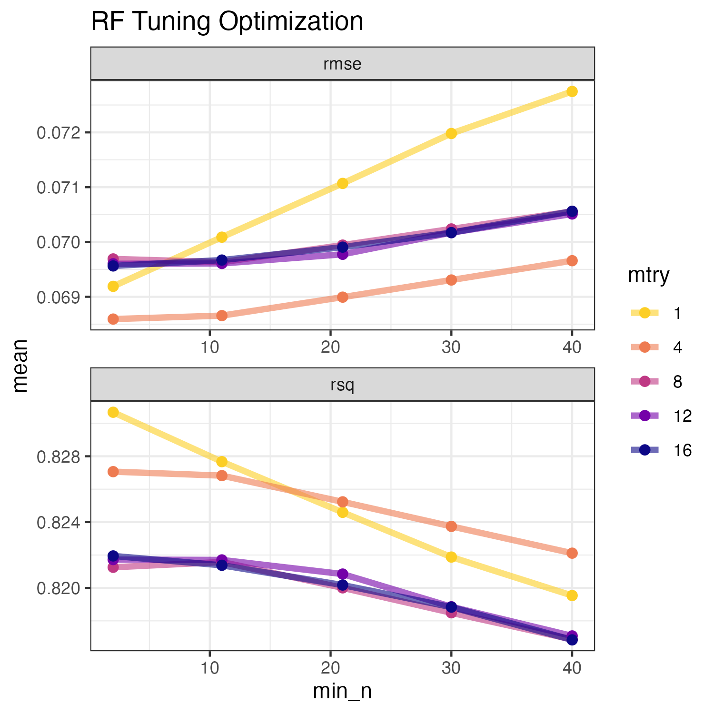
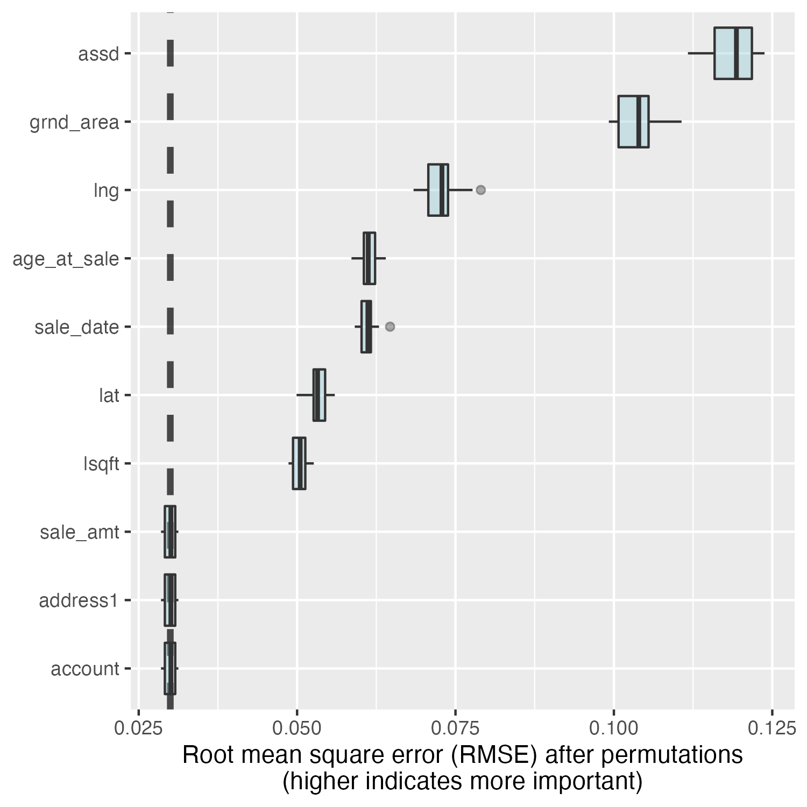
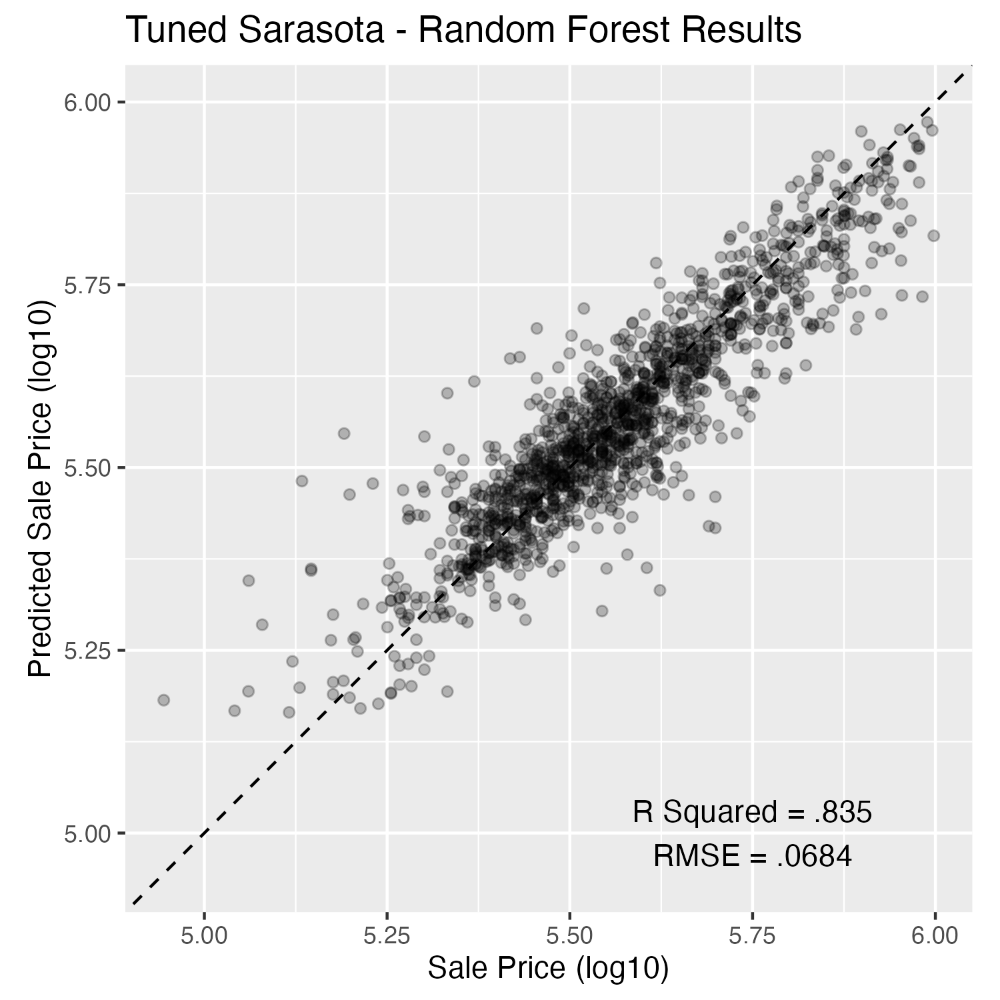

```{r setup, include=FALSE}
library(dplyr)
library(DT)
library(flexdashboard)
library(ggplot2)
library(hexbin)
library(htmltools)
library(leaflet)
library(leafpop)
library(plotly)
library(scales)
library(shiny)
library(shinycssloaders)
library(shinyWidgets)
library(sf)
library(showtext)
library(tibble)
library(tidyr)
library(webshot)
library(tidymodels)

thematic::thematic_rmd(font = "auto")
```

```{r load-data}
beaches <- readRDS("./sarco_beaches.rds")
homes <- readRDS("./sarasota_homes.rds")
hurricanes <- readRDS("./hurricanes.rds")
prices <- readRDS("./sarasota_prices.rds")
sarasota_boundary <- readRDS("./sarasota_boundary.rds")
sbdv <- readRDS("./subdivisions.rds")
zips <- readRDS("./sarco_zips.rds")
#final_model <- readRDS("./final_rand_forest_model.rds")
```


Background
===================================== 

Column {.sidebar data-width=350}
------------------

#### About

[Sarasota County](https://www.scgov.net), Florida, is located on the west coast below Tampa, Florida.  The population, according to the 2020 census,  was 434,006. The [City of Sarasota](https://www.sarasotafl.gov) on the northern most boundary of the county, is the county seat.  The county's creation dates to 1921 when Manatee County was subdivided. Aside from the City of Sarasota (pop. 54,842), four other municipalities are within the county.  In descending order by population, they are the [City of Northport](https://www.cityofnorthport.com) (pop. 74,793), the [City of Venice](https://www.venicegov.com) (pop. 25,463) and the [Town of Longboat Key](https://www.longboatkey.org) (pop. 7505). See the inset map.

#### Beaches

Florida is known for its beaches and warm weather. According to the EPA's most recent data,
Sarasota is home to 34 beaches with a total coastline of 34.75 miles. A complete listing, along with amenities, is available on Sarasota County's [website](https://www.scgov.net/government/parks-recreation-and-natural-resources/find-a-park/beaches).  Two valuable sources for  information include the [Mote Beach Conditions Reporting System](https://visitbeaches.org) and the EPA's BEACON [program](https://beacon.epa.gov/ords/beacon2/f?p=BEACON2:12:::NO::P12_YEARS:Current). Visitors can enroll and receive advisories and closing information from the EPA.

#### Airport 

The [Sarasota-Bradenton International Airport](https://srq-airport.com) (SRQ) dates to 1939 when Manatee and Sarasota Counties agreed to jointly construct the airport. The aiport's 1100 acres straddle the Sarasota-Manatee county line, with the majority in Sarasota County.   The top 3 airlines are Southwest, Delta, and Allegiant having a combined market share of 60%. The airport contains two terminals and thirteen gates. Downtowns Sarasota and Bradenton are three and six miles, respectively, from the airport.


Column
-------------------------------------
   
### Map -- Sarasota County Boundaries

```{r map-sarasota}
leaflet() |> 
setView(lng = -82.3658, lat = 27.1818, zoom = 11) |>
# base groups
addTiles(group = "OSM (default)") |>
addProviderTiles(providers$CartoDB.Positron, group = "Positron") |> 
addProviderTiles(providers$Stamen.TonerLite, group = "Toner Lite") |> 
# overlay groups
addPolygons(data = sarasota_boundary,
	    color = ~color,
	    popup = ~muni_names,
	    group = "Cities") |> 
addPolygons(data = zips,
	    popup = popupTable(zips),
	    group = "Zip Codes") |> 
addMarkers(data = beaches,
	   popup = popupTable(beaches),
	   group = "Beaches") |> 
addLayersControl(
	baseGroups = c("OSM (default)", "Positron", "Toner Lite"),
	overlayGroups = c("Cities", "Zip Codes", "Beaches"),
	position = "topright",
	options = layersControlOptions(collapsed = FALSE)
) |> 
hideGroup(c("Beaches", "Zip Codes"))
```

Overview
===================================== 

Column {.sidebar data-width=350}
------------------

#### Criteria:

Fifty-seven Sarasota County home sales exceeded five million dollars. The maximum sale was $16.7 million.  These "high-dollar" sales were outliers among the 71,863 sales examined.  Nontheless, they presented challenges in plotting the dataset.  The partial solution was to limit the plot to five million and for the outliers to "stick" to the top of the chart.

```{r ov-inputs}
h6("Plot type:")
radioButtons(
  inputId = "ov_plot_type",
  label = NULL,
  choices = c("scatter_plot", "violin_plot"),
  selected = "scatter_plot",
  inline = FALSE,
  width = NULL,
)
h6("Y-axis:")
pickerInput(
	inputId = "ov_y_axis",
	choices = c("sale_amt_infl_adj",
		    "usd_per_sq_ft"),
	selected = "sale_amt_infl_adj",
	multiple = F,
	choicesOpt = list(
		content = c("Sale Amt. Infl. Adj.",
			    "Price Per Sq. Ft.")
		)
)
h6("Group by:")
pickerInput(
	inputId = "ov_group",
	choices = c("water", "age_class", "land_use",
		    "loccity", "municipality", "bedr",
		    "bath", "home_owner", "stcd"),
	selected = "water",
	multiple = F,
	choicesOpt = list(
		content = c("On/Off Water",
			    "Age Class",
			    "Homes/Condos",
			    "By City",
			    "By Municipality",
			    "Bedrooms",
			    "Bathrooms",
			    "Full-time/Part-time Owner",
			    "Land Use Code")
		)
)
```

Column 
-------------------------------------

### Plots --Sarasota Co. Property Records

```{r ov-interactive-plots}
renderPlot({
if(input$ov_plot_type == "scatter_plot")
{
	#scatter plot begin ----
	if(input$ov_y_axis == "sale_amt_infl_adj"){
		limits = c(0, 5e6)
	}else{
		limits = c(0, 1000)
	}
	homes |>
		tidyr::drop_na(input$ov_group) |> 
		ggplot() +
		aes_string(x = "sale_date",
			   y = input$ov_y_axis,
			   group = input$ov_group) +
		geom_point(shape = 1) +
		geom_smooth(method = 'gam', formula = y ~ s(x, bs = "cs")) +
		facet_wrap(~get(input$ov_group)) +
		scale_y_continuous(name = "",
				   label = comma,
				   limits = limits,
				   oob = scales::squish) +
		scale_x_date(name = "") +
		labs(title = "Sarasota Co. Florida Property Sales (1966 - 2022)",
		     subtitle = "Adj. for inflation 2020 Base Year",
		     caption = "Credit: Sarasota Co. Property Appraiser") +
		theme(strip.text = element_text(size = rel(1.2)),
		      axis.text = element_text(size = rel(1.2)),
		      plot.title = element_text(size = rel(2.2)),
		      plot.subtitle = element_text(size = rel(2.2))
		      )
	# scatter plot end ----
}
else
{
	# violin plot begin ----
	if(input$ov_y_axis == "sale_amt_infl_adj"){
		limits = c(0, 5e6)
	}else{
		limits = c(0, 1000)
	}
homes |>
	tidyr::drop_na(input$ov_group) |> 
	ggplot() +
	aes_string(x = input$ov_group,
		   y = input$ov_y_axis) +
	geom_violin(aes_string(fill = input$ov_group)) +
	scale_y_continuous(name = "",
			   limits = limits,
			   label = comma,
			   oob = scales::squish) +
	scale_x_discrete(name = "") +
	labs(title = "Sarasota Co. Florida Property Sales (1966 - 2022)",
	     subtitle = "Adj. for inflation 2020 Base Year",
	     alt = 'Violin Plot of Sarasota County Properties',
	     caption = "Credit: Sarasota Co. Property Appraiser") +
	theme(strip.text = element_text(size = rel(1.2)),
		      axis.text = element_text(size = rel(1.2)),
		      plot.title = element_text(size = rel(2.2)),
		      plot.subtitle = element_text(size = rel(2.2))
		      )
	# violin plot end ----
}
})

```

Row {data-height=300}
-------------------------------------

### Sarasota County Home Sales by Month

```{r homes-time-series-1}
p <- homes |>
filter(sale_date > "1980-01-01") |>
select(sale_date) |>
group_by(month = lubridate::floor_date(sale_date, 'month')) |>
summarize(home_sales = n()) |>
 ggplot() +
	aes(month, home_sales) +
	geom_line() +
	geom_smooth() +
	theme()
ggplotly(p)

```

Home Prices
===================================== 

Column {.sidebar data-width=350}
------------------

### Criteria:

```{r home-price-inputs}
h6("Location City:")
pickerInput("hp_loccity",
choices = sort(unique(prices$loccity)),
selected = sort(unique(prices$loccity)),
multiple = T,
options = list(
`actions-box` = TRUE,
`deselect-all-text` = "None",
`select-all-text` = "All",
`none-selected-text` = "zero"
)
)
h6("On the water:")
pickerInput("hp_water",
choices = sort(levels(prices$water)),
selected = sort(unique(prices$water)),
multiple = T,
options = list(
`actions-box` = TRUE,
`deselect-all-text` = "None",
`select-all-text` = "All",
`none-selected-text` = "zero"
)
)
h6("Land Use:")
pickerInput("land_use",
choices = sort(levels(prices$land_use)),
selected = sort(unique(prices$land_use)),
multiple = T,
options = list(
`actions-box` = TRUE,
`deselect-all-text` = "None",
`select-all-text` = "All",
`none-selected-text` = "zero"
)
)
h6("Range Sale Amt:")
pickerInput("hp_min_sale_amt",
label = "Min:",
inline = TRUE,
choices = seq(0, 9e5, 1e5),
selected = 0,
multiple = F,
width = "fit",
choicesOpt = list(
content = paste0("$", format(seq(0, 9e5, 1e5), big.mark = ","))
)
)
pickerInput("hp_max_sale_amt",
label = "Max:",
inline = TRUE,
choices = seq(1e5, 1e6, 1e5),
selected = 1e6,
multiple = F,
width = "fit",
choicesOpt = list(
content = paste0("$", format(seq(1e5, 1e6, 1e5), big.mark = ","))
)
)
h6("Range Price / Sq. Ft:")
pickerInput("hp_min_usd_per_sq_ft",
label = "Min:",
inline = TRUE,
choices = seq(0, 500, 100),
selected = 0,
multiple = F,
width = "fit",
choicesOpt = list(
content = paste0("$", format(seq(0, 500, 100), big.mark = ","))
)
)
pickerInput("hp_max_usd_per_sq_ft",
label = "Max:",
inline = TRUE,
choices = seq(100, 600, 100),
selected = 600,
multiple = F,
width = "fit",
choicesOpt = list(
content = paste0("$", format(seq(100, 600, 100), big.mark = ","))
)
)
h6("Year Built:")
sliderInput("hp_yrbl",
      label = NULL,
      min = 1910,
      max = 2030,
      value = c(1910, 2030),
      step = 10,
      sep = ""
)
h6("Living Area (Sq. Ft.):")
pickerInput("hp_min_living",
          label = "Min:",
          inline = TRUE,
          choices = seq(500, 5000, 500),
          selected = 0,
          multiple = F,
          width = "fit",
          choicesOpt = list(
              content = paste0(format(seq(500, 5000, 500), 
              			big.mark = ","), " sq. ft.")
          )
)
pickerInput("hp_max_living",
          label = "Max:",
          inline = TRUE,
          choices = seq(5500, 1000, -500),
          selected = 5500,
          multiple = F,
          width = "fit",
          choicesOpt = list(
              content = paste0(format(seq(5500, 1000, -500), 
              			big.mark = ","), " sq. ft.")
          )
)
h6("Bedrooms:")
pickerInput("hp_bedr",
      inline = FALSE,
      choices = 1:6,
      selected = 1:6,
      multiple = T,
      options = list(
          `actions-box` = TRUE,
          `deselect-all-text` = "None",
          `select-all-text` = "All",
          `none-selected-text` = "zero"
      ),
      choicesOpt = list(
          content = paste0(1:6, " BR")
      )
)
h6("Baths:")
pickerInput("hp_bath",
      inline = FALSE,
      choices = 1:6,
      selected = 1:6,
      multiple = T,
      options = list(
          `actions-box` = TRUE,
          `deselect-all-text` = "None",
          `select-all-text` = "All",
          `none-selected-text` = "zero"
      ),
      choicesOpt = list(
          content = paste0(1:6, " bath")
      )
)
actionButton("hp_button_filter",
"Add Markers!",
class = "btn-success"
)
```

Column
------------------

### Map -- 2021 Sarasota Co. Home Prices

```{r map-home-prices}
hp_filtered <- eventReactive(input$hp_button_filter, {
    prices |>
      dplyr::filter(loccity %in% input$hp_loccity) |>
      dplyr::filter(water %in% input$hp_water) |>
      dplyr::filter(land_use %in% input$land_use) |>
      dplyr::filter(sale_amt >= as.numeric(input$hp_min_sale_amt)) |>
      dplyr::filter(sale_amt <= as.numeric(input$hp_max_sale_amt)) |>
      dplyr::filter(usd_per_sq_ft >= as.numeric(input$hp_min_usd_per_sq_ft)) |>
      dplyr::filter(usd_per_sq_ft <= as.numeric(input$hp_max_usd_per_sq_ft)) |>
      dplyr::filter(yrbl >= input$hp_yrbl[1] & yrbl <= input$hp_yrbl[2]) |> 
      dplyr::filter(living >= as.numeric(input$hp_min_living)) |>
      dplyr::filter(living <= as.numeric(input$hp_max_living)) |>
      dplyr::filter(bedr %in% input$hp_bedr) |>
      dplyr::filter(bath %in% input$hp_bath)
  })
renderLeaflet({
    if (input$hp_button_filter == 0) {
      leaflet() |>
        setView(lng = -82.3658, lat = 27.1818, zoom = 10) |>
        addTiles() |>
        addMarkers(
          data = prices,
          clusterOptions = markerClusterOptions(),
          lng = prices$lng,
          lat = prices$lat,
          popup = popupTable(prices,
            zcol = c(
              "loccity",
              "address1",
              "name1",
              "sale_amt",
              "sale_date",
              "living",
              "bedr",
              "bath",
              "usd_per_sq_ft",
              "age_now",
              "water"
            )
          )
        ) |>
        addMarkers(
          lat = 27.077317846639275,
          lng = -82.36207377345794,
          popup = "Lori lives here!",
          options = list(color = "#ffc0cb")
        )
    }
      else if(input$hp_button_filter > 0 & nrow(hp_filtered()) > 0)
          {
          # leaflet map begin ----
      leaflet() |>
        setView(lng = -82.3658, lat = 27.1818, zoom = 10) |>
        addTiles() |>
        addMarkers(
          data = hp_filtered(),
          clusterOptions = markerClusterOptions(),
          lng = hp_filtered()$lng,
          lat = hp_filtered()$lat,
          popup = popupTable(hp_filtered(),
            zcol = c(
              "loccity",
              "address1",
              "name1",
              "sale_amt",
              "sale_date",
              "living",
              "bedr",
              "bath",
              "usd_per_sq_ft",
              "age_now",
              "water"
            )
          )
        ) |>
        addMarkers(
          lat = 27.077317846639275,
          lng = -82.36207377345794,
          popup = "Lori lives here!",
          options = list(color = "#ffc0cb")
        )
          #leaflet map end ----
      } else {
          leaflet() |>
              setView(lng = -82.3658, lat = 27.1818, zoom = 10) |>
              addTiles()
    }
  })
```

Row {data-height=120}
-------------------------------------
### Number of Sales

```{r hp-number-of-sales}
renderValueBox({
if (input$hp_button_filter == 0) 
{
valueBox(nrow(prices), caption = "homes and condos were sold in Sarasota County in 2021", icon="fa-home")
}
else if(input$hp_button_filter > 0 & nrow(hp_filtered()) > 0)
{
valueBox(nrow(hp_filtered()), caption = "homes and condos were sold meeting criteria.", icon="fa-home")
} 
else
{
valueBox(nrow(hp_filtered()), caption = "No homes or condos met criteria. Please revise inputs.", icon="fa-home", color = "danger")
}
  })
```   

### Median Sale

```{r hp-median-sale}
renderValueBox({
if (input$hp_button_filter == 0) 
{
hp_median_sale <- paste0("$",
			 format(median(prices$sale_amt), 
			        big.mark = ","))
valueBox(hp_median_sale, caption = "was the median price paid for a home or condo in Sarasota County in 2021", icon="fa-home")
}
else if(input$hp_button_filter > 0 & nrow(hp_filtered()) > 0)
{
hp_median_sale <- 
	hp_filtered() |> 
	dplyr::select(sale_amt) |> 
	tidyr::drop_na(sale_amt) |> 
	dplyr::summarize(median = median(sale_amt)) |> 
	dplyr::pull()
hp_median_sale_format <- paste0("$", 
				format(hp_median_sale,
				       big.mark = ","))
valueBox(hp_median_sale_format, caption = "was the median price paid for homes or condos meeting criteria.", icon="fa-home")
}
else
{
hp_median_sale <- "$0"
valueBox(hp_median_sale, caption = "No homes or condos met criteria. Please revise inputs.", icon="fa-home",
	 color = "danger")
}
  })
```

### Average Price Per Sq. Ft.
```{r hp-avg-price-per_sq_ft}
    renderValueBox({
if (input$hp_button_filter == 0) 
{	
hp_price_per_sq_ft <- 
	prices |> 
	select(usd_per_sq_ft) |> 
	summarize(mean = mean(usd_per_sq_ft, na.rm = T)) |> 
	mutate(mean = round(mean, 0)) |> 
	mutate(mean = paste0("$", mean)) |> 
	pull(mean)

    valueBox(hp_price_per_sq_ft, caption = "was the average price paid per square foot for a home or condo in Sarasota County in 2021", icon="fa-home")
}
else if(input$hp_button_filter > 0 & nrow(hp_filtered()) > 0)
{
hp_price_per_sq_ft <- 
		hp_filtered() |> 
		select(usd_per_sq_ft) |> 
		summarize(mean = mean(usd_per_sq_ft, na.rm = T)) |> 
		mutate(mean = round(mean, 0)) |> 
		mutate(mean = paste0("$", mean)) |> 
		pull(mean)
valueBox(hp_price_per_sq_ft, caption = "was the average price paid per square foot for a home or condo in Sarasota County in 2021", icon="fa-home")	
}
else
{
hp_price_per_sq_ft <- "$0"
valueBox(hp_price_per_sq_ft, caption = "No homes or condos met criteria. Please revise inputs.", icon="fa-home",
	 color = "danger")	
}
  })
```

Subdivisions
===================================== 

Column {.sidebar data-width=350}
------------------

### Criteria:

Sarasota County contains 5113 subdivisions within the county. Here, subdivisions were filtered by number of lots. Subdivisions with lots fewer than 20 were omitted.

While sale amounts were adjusted for inflation, they do not account for the dramatic rise in housing prices in 2021 and, perhaps, 2022. The price of a home could deviate _wildly_ from the average price in the subdivision as reported here.

```{r inputs-sbdv}
h6("Municipality:")
pickerInput(
	inputId = "sb_municipality",
	label = NULL,
	choices = sort(unique(sbdv$municipality)),
	selected = unique(sbdv$municipality),
	multiple = T,
	options = list(
	      `actions-box` = TRUE,
	      `deselect-all-text` = "None",
	      `select-all-text` = "All",
	      `none-selected-text` = "zero"
	      )
      )
h6("Avg. Sale Price: ")
sliderInput(
	inputId = "sb_avg_sale",
	label = NULL,
	min = 0,
	max = 2.5e6,
	value = c(0, 2.5e6),
	step = 2.5e5,
	ticks = TRUE
)
h6("Avg. Living space (sq. ft.):")
sliderInput(
	inputId = "sb_avg_living",
	label = NULL,
	min = 0,
	max = 4500,
	value = c(0, 4500),
	step = 500
)
h6("Avg. Price Per Sq. Ft. ($):")
sliderInput(
	inputId = "sb_avg_usd_sq_ft",
	label = NULL,
	min = 0,
	max = 600,
	value = c(0, 600),
	step = 50
)
h6("Avg. Age (years):")
sliderInput(
	inputId = "sb_avg_age",
	label = NULL,
	min = 0,
	max = 80,
	value = c(0, 80),
	step = 10
)
h6("Number of Lots:")
sliderInput(
	inputId = "sb_lots",
	label = NULL,
	min = 0,
	max = 900,
	value = c(0, 900),
	step = 50
)
actionButton(
	inputId = "sb_button_filter",
	label = "Filter results!",
	class = "btn-success"
)
```

```{r filtered-subdv, eval=F, include=F}
sb_filtered <- eventReactive(input$sb_button_filter,{
    sbdv |> 
    dplyr::filter(municipality %in% input$sb_municipality) |> 
    dplyr::filter(avg_sale >= input$sb_avg_sale[1] & avg_sale <= input$sb_avg_sale[2]) |> 
    dplyr::filter(avg_living >= input$sb_avg_living[1] & avg_living <= input$sb_avg_living[2]) |> 
    dplyr::filter(avg_usd_sq_ft >= input$sb_avg_usd_sq_ft[1] & avg_usd_sq_ft <= input$sb_avg_usd_sq_ft[2]) |> 
    dplyr::filter(avg_age >= input$sb_avg_age[1] & avg_age <= input$sb_avg_age[2]) |> 
    dplyr::filter(lots >= input$sb_lots[1] & lots <= input$sb_lots[2])
  })
```

Column {.tabset}
-------------------------------------
   
### Map -- Sarasota Co. Subdivisions

```{r map-sbdv}
sb_filtered <- eventReactive(input$sb_button_filter,{
    sbdv |> 
    dplyr::filter(municipality %in% input$sb_municipality) |> 
    dplyr::filter(avg_sale >= input$sb_avg_sale[1] & avg_sale <= input$sb_avg_sale[2]) |> 
    dplyr::filter(avg_living >= input$sb_avg_living[1] & avg_living <= input$sb_avg_living[2]) |> 
    dplyr::filter(avg_usd_sq_ft >= input$sb_avg_usd_sq_ft[1] & avg_usd_sq_ft <= input$sb_avg_usd_sq_ft[2]) |> 
    dplyr::filter(avg_age >= input$sb_avg_age[1] & avg_age <= input$sb_avg_age[2]) |> 
    dplyr::filter(lots >= input$sb_lots[1] & lots <= input$sb_lots[2])
  })
renderLeaflet({
if(input$sb_button_filter == 0){
		# begin basemap ----
		leaflet() |>
		setView(lng = -82.3658, lat = 27.1818, zoom = 11) |>
		addTiles() |>
		addPolygons(
			data = sbdv,
			popup = popupTable(
				sbdv,
				zcol = -10
			)
		)
		# end basemap ----
}else{
		# begin filtered map ----
		leaflet() |> 
		setView(lng = -82.3658, lat = 27.1818, zoom = 11) |>
		addTiles() |>
		addPolygons(
			data = sb_filtered(),
			popup = popupTable(
				sb_filtered(),
				zcol = -10
			)
		)
		# end filtered map ----
}
})
```   

### Table -- Sarasota Co. Subdivisions

```{r table-sbdv}
renderDataTable({
	data <-	sb_filtered() |>
		select(-geometry) 
	DT::datatable(
		data,
		extensions = 'Buttons', 
		options = list(
			dom = 'Bfrtip',
			buttons = c('copy', 
				    'csv', 
				    'excel', 
				    'pdf', 
				    'print'
				    )
  ))
})
```


Hurricanes
===================================== 

Column {.sidebar data-width=350}
-------------------------------------

### Background

Nearly 500 hurricanes have been documented to have hit Florida. The most recent and devastating storms were Hurricane Andrew (1992), Hurricane Irma (2017) and Hurricane Michael (2018). According to wikipedia, the collective economic damage from hurricanes totals $216 billion 2018 dollars.

### Building Codes

Hurricane Andrew (1992), and the subsequent rebuilding, served as the impetus for revisions to Florida's building codes. Andrew is listed as the eighth costliest hurricane in US history.  Sixty-five deaths and $27.3 billion in damages were attributed to the storm. The Florida Legislature passed the Florida Building Code in 1998 and it became effective in 2002.

### Hurricane Evacuation Levels

Low lying areas are especially vulnerable in a hurricane because of storm surge.  "Evacuation Zones" are designated by letter from "Zone A" to "Zone F".  Zone A includes low lying areas along the coasts and river basins. Residents living in Zone A are ordered to evacuate first.

Column {.tabset}
-------------------------------------

### Sarasota Hurricane Zones

<iframe width="100%" height="100%" frameborder="0" scrolling="no" allowfullscreen src="https://arcg.is/10j0jr"></iframe>

### Florida Hurricanes

```{r table-hurricanes, cache = T}
DT::datatable(hurricanes)
```

Predictions
===================================== 

Column {.sidebar data-width=350}
-------------------------------------

### Inputs

```{r inputs-pred}
#sale date
dateInput("pd_sale_date", 
	  "Sale Date:", 
	  value = "2022-06-30",
	  min = "2022-01-01",
	  max = Sys.Date(),
	  format = "yyyy-mm-dd")
# ground area
numericInput("pd_grnd_area",
	     "Ground area (sq. ft.):", 
	     value = 1000, 
	     min = 100,
	     max = 10000)
# linear square feet
numericInput("pd_lsqft",
	     "Linear (sq. ft.):", 
	     value = 1000, 
	     min = 100,
	     max = 10000)
# assessed amount
numericInput("pd_assd",
	     "Assessment ($):", 
	     value = 1e5, 
	     min = 1e5,
	     max = 1e6)
# age at sale
numericInput("pd_age_at_sale",
	     "Age at sale (years):", 
	     value = 25, 
	     min = 1,
	     max = 100)
# longitude
numericInput("pd_lng",
	     "Longitude (degrees):", 
	     value = -82.4, 
	     min = -82.6,
	     max = -82.0)
# latitude
numericInput("pd_lat",
	     "Latitude (degrees):", 
	     value = 27.2, 
	     min = 26.9,
	     max = 27.4)
#action button
actionButton("pred_button_table",
"Get Prediction!",
class = "btn-success"
)
```

```{r data-pred, eval=F, include=F}
pred_home_price <- eventReactive(input$pred_button_table,{
    new_data <-
    	tibble(
    	   sale_amt    = NA,
    	   sale_date   = input$pd_sale_date,
           grnd_area   = input$pd_grnd_area,
           lsqft       = input$pd_lsqft,
           assd        = input$pd_assd,
           age_at_sale = input$pd_age_at_sale,
           lng         = input$pd_lng,
           lat         = input$pd_lat
           )
    predict(
		final_model,
		new_data = new_data |> select(-sale_amt)
	) |>
    	mutate(.pred = 10^.pred) |> 
    	pull(.pred)
})
```

### Prediction:

The predicted home value is:

```{r home-prediction, eval=F, include=F}
#result 
renderText({
        paste0(
            "$",
            prettyNum(
                pred_home_price(),
                big.mark = ",",
                digits = 2
            )
        )
})
```


Column {data-height=400}
-------------------------------------


### Ranger Tuning Optimization

```{r output-pred-sale-amt}

```

### Variable Importance

```{r image-1}

```

Row
----------------------

### Average Price by Location

```{r price-hex, include=TRUE}
sarco_hex <-
	prices |> 
	select(sale_amt, lng, lat) |> 
	ggplot() +
	aes(x = lng, y = lat, z = sale_amt) +
	stat_summary_hex(alpha = .8, bins = 30) +
	scale_fill_viridis_c() + 
	labs(fill = "Avg_Price", 
	     title = "Sarasota Co. Home Prices") +
	xlab(label = "Longitude") +
	ylab(label = "Latitude")
	
plotly::ggplotly(sarco_hex)	
```

### Model Test Results

```{r image}

```


